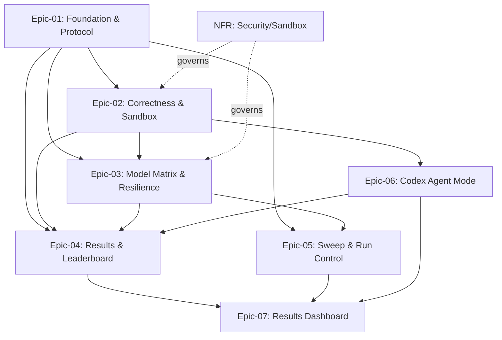

# USER STORIES — PROJECT OVERVIEW

> `local-code-bench` — benchmark harness for local, cloud, and Codex coding runs.
> Source: [`REQUIREMENTS.md`](../REQUIREMENTS.md) (v1). Generated by `/generate-epics` on 2026-06-20.

## User Personas

### Primary Personas

#### The Local-AI Tinkerer (FX + public-repo audience)
- **Role**: Senior engineer running local coding models and Codex on a personal Apple Silicon Mac (M3 Max, 48 GB).
- **Goals**: Find the fastest *usable* local coding model on their hardware; decide whether local is worth it vs. paying per-token on OpenRouter; measure Codex as an agent baseline; re-check cheaply when a new model/quant drops.
- **Pain Points**: Blog benchmarks run on different hardware (64 GB ≠ 48 GB), aren't reproducible, and score no correctness — a fast model that writes broken code looks like a winner. No one has put local tok/s and cloud $/task on the same axis.

### Secondary Personas

#### The Reproducer (open-source visitor)
- **Role**: Someone who finds the public repo and wants to re-run the benchmark or add a model.
- **Goals**: Run the suite unattended with one command; add a model by editing config, not code.
- **Pain Points**: Most benchmark code is bespoke and undocumented; bring-up steps are missing.

## Epic Overview

| Epic ID | Epic Name | Business Value | Story Count | Total Points | Priority |
|---------|-----------|----------------|-------------|--------------|----------|
| Epic-01 | Foundation & Endpoint Protocol | Measure any OpenAI-compatible endpoint with trustworthy speed metrics | 7 | 21 | Must Have (MVP) |
| Epic-02 | Correctness Suite & Sandbox | Score whether generated code actually works, safely | 5 | 16 | Must Have (MVP) |
| Epic-03 | Full Model Matrix & Resilience | Run all 5 backends incl. cost, surviving flaky models | 7 | 22 | Must Have (MVP) |
| Epic-04 | Results & Leaderboard | Turn raw runs into a publishable, re-scorable ranking | 3 | 10 | Must Have (MVP) |
| Epic-05 | Sweep Mode & Run Control | Reproduce the prefill-vs-context thesis; resume runs | 3 | 9 | Should Have (v1.x) |
| Epic-06 | Codex Agent Mode | Benchmark Codex CLI on the same task suites | 4 | 13 | Must Have (MVP) |
| Epic-07 | Results Dashboard | Explore benchmark runs through static and live local dashboard views | 6 | 20 | Should Have (v2) |
| NFR | Non-Functional Requirements | Accuracy, security, quality, portability, hardware fit | 5 | 12 | Mixed (SEC/QUAL = MVP) |

## Epic Navigation

- **[Epic-01: Foundation & Endpoint Protocol](./stories/epic-01-foundation-endpoint-protocol.md)** — `uv` scaffold, `models.yaml`, OpenAI-compatible provider, streaming metrics (TTFT/prefill/decode/latency), JSONL writer, CLI entrypoint.
- **[Epic-02: Correctness Suite & Sandbox](./stories/epic-02-correctness-suite-sandbox.md)** — HumanEval/MBPP loaders, sandboxed code execution, pass@1 scoring at temp 0.
- **[Epic-03: Full Model Matrix & Resilience](./stories/epic-03-model-matrix-resilience.md)** — OpenRouter + Anthropic + local MLX backends, cost calc, reproducibility metadata, fault tolerance, backend subset.
- **[Epic-04: Results & Leaderboard](./stories/epic-04-results-leaderboard.md)** — `LEADERBOARD.md` generator, offline re-score, README bring-up guide.
- **[Epic-05: Sweep Mode & Run Control](./stories/epic-05-sweep-run-control.md)** — agentic-preamble padding sweep, prefill-vs-context curve, resume.
- **[Epic-06: Codex Agent Mode](./stories/epic-06-codex-agent-mode.md)** — `configs/agents.yaml`, task workspaces, `codex exec` runner, agent-mode scoring and CLI.
- **[Epic-07: Results Dashboard](./stories/epic-07-results-dashboard.md)** — static HTML dashboard, CLI-served live results endpoints, drilldown views, and basic tradeoff/sweep charts.
- **[Non-Functional Requirements](./stories/non-functional-requirements.md)** — performance, security, quality, integration, infrastructure.

## MVP Summary

### MVP Criteria
v1 is "done" (per `REQUIREMENTS.md` §6) when one command runs the full HumanEval (+MBPP) suite against any subset of the 5 endpoint backends unattended, Codex agent mode runs through `codex exec` on the same task abstraction, per-task speed/correctness/cost-or-availability metadata is captured to JSONL, a ranked `LEADERBOARD.md` regenerates with endpoint and agent sections, generated code is sandboxed, flaky backends do not abort the run, and reproducibility metadata is recorded.

### MVP Scope
- **In MVP**: Epics 01–04 and Epic-06 (all P0), plus NFR-SEC-001 (sandbox/secrets) and NFR-QUAL-001 (TDD coverage).
- **Out of MVP (v1.x / v2)**: Epic-05 (sweep, P1), Epic-07 (dashboard/charts), and the deferred items named in REQUIREMENTS.md §5 P2 — Claude Code agentic loop, SWE-bench-lite, LLM-judge quality.

### MVP Epic Breakdown
| Phase (REQUIREMENTS §7) | Epic | Milestone |
|---|---|---|
| Phase 0 — Skeleton & protocol | Epic-01 | One model, one prompt, real metrics in JSONL |
| Phase 1 — Correctness & sandbox | Epic-02 | pass@1 scored for one backend on full HumanEval |
| Phase 2 — Full matrix & resilience | Epic-03 | Unattended 5-backend run survives a killed local server |
| Phase 3 — Codex agent mode & leaderboard | Epic-06 + Epic-04 | Codex agent run captured; committed endpoint and agent leaderboard |
| Phase 4 — Sweep (stretch) | Epic-05 | Prefill-vs-context curve reproduced |

## Project Metrics

- **Total Stories**: 40
- **Total Story Points**: 123
- **MVP Stories**: ~28 (Epics 01–04 + Epic-06 + NFR-SEC/QUAL)
- **MVP Points**: ~88

## Story Dependencies

### Cross-Epic Dependencies

### Critical Path
Epic-01 (provider + metrics + JSONL) → Epic-02 (sandbox + pass@1) → Epic-03 (all endpoint backends + cost + resilience) and Epic-06 (Codex agent mode) → Epic-04 (leaderboard). Epic-05 branches off Epic-03 and is non-blocking for MVP.
