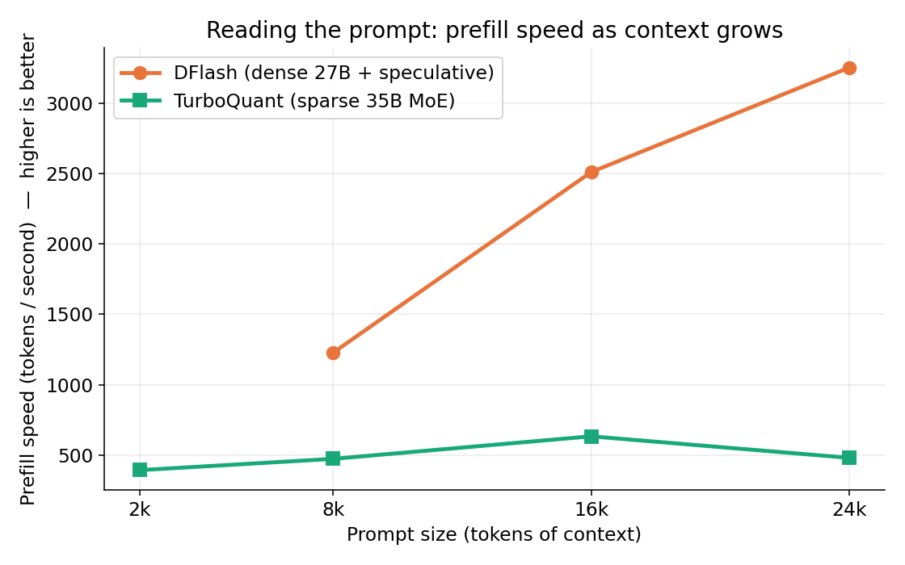
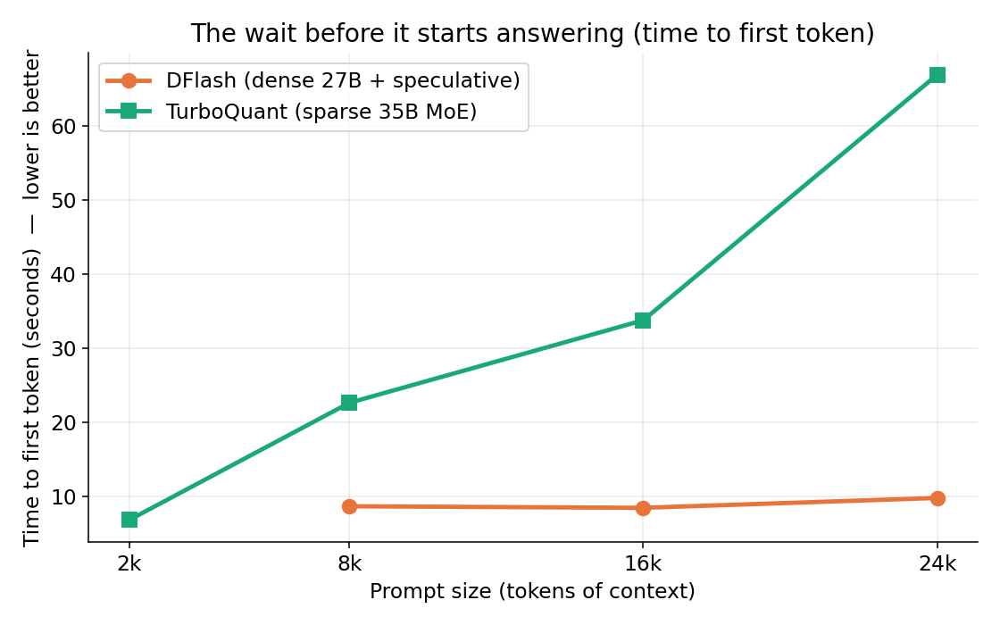
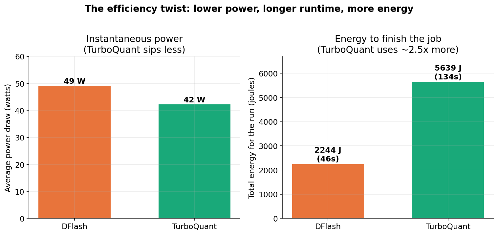

# Can Your Laptop Run the AI That Writes Your Code? A First Measurement

*Part 1 of a series on benchmarking local models for agentic coding.*

Most people who use an AI coding assistant today are quietly renting a
supercomputer. Every keystroke of help comes from a giant model running in a data
centre somewhere, billed by the token, and it only works when you have a network
connection and a willingness to send your code to someone else's machine.

A reasonable question is starting to have a non-obvious answer: do you actually
need the data centre? Modern laptops, especially Apple Silicon machines with lots
of fast memory, can now run surprisingly capable models entirely on-device. If that
works well enough, it changes the economics and the privacy story of AI-assisted
coding completely. No per-token bill, no data leaving your laptop, and it works on
a plane.

This article is the first in a series where we try to answer that question with
numbers instead of vibes. The goal is not to crown a winner once and walk away. It
is to build a fair, repeatable way to measure whether running coding agents locally
is genuinely useful, and then to actually run it. This first installment sets up the
method and reports a clean, reproducible head-to-head between two very different
ways of squeezing a large model onto a laptop. The result surprised us, and it
contradicts the conventional wisdom we started with.

Everything below is explained from the ground up. If you already know what
quantization and speculative decoding are, skim ahead. If you do not, you will by
the end.

## The challenge: big brains, small box

The models that are good at coding are big. "Big" here means billions of internal
numbers, called parameters, that encode what the model knows. A capable open model
might have 27 billion or 35 billion of them. Each parameter normally takes two bytes
of memory, so a 27-billion-parameter model wants around 54 gigabytes just to sit in
memory, before it does any actual work.

A laptop does not have that to spare. The machine we used has 48 gigabytes of
memory shared between everything, including the operating system and your other
apps. So the first problem is simply fitting the model in the box. The second
problem is making it fast enough to be useful. Both problems have clever solutions,
and the two competitors in this test represent two different bets on how to solve
them.

## Trick one: quantization (shrinking the model)

The first trick is **quantization**. Instead of storing each of those billions of
numbers at full two-byte precision, you store them in a compressed, lower-precision
form, often around 3 or 4 bits each instead of 16. The model gets roughly four to
five times smaller and therefore fits in memory and moves around faster.

The useful analogy is an MP3. A studio master recording is enormous and pristine.
An MP3 throws away detail you mostly cannot hear and lands at a fraction of the
size. Quantization does the same thing to a model's parameters: it discards
precision the model mostly does not need, in exchange for fitting on your hardware.
Push it too far and quality audibly degrades, just like a badly compressed MP3.
Both models in this test are quantized, which is the only reason they fit on a 48 GB
laptop at all.

## Trick two, version A: a dense model that drafts ahead (DFlash)

Once the model fits, you want it to be fast. Here the two competitors diverge.

The first competitor is a **dense** model sped up with **speculative decoding**,
served by a tool called **DFlash**. We need two terms here.

"Dense" means every one of the model's parameters is used for every word it
processes. The whole brain lights up for every token. It is thorough but expensive.

"Speculative decoding" is a genuinely clever speed trick. Normally a model writes
one token, then the next, then the next, strictly one at a time, which is slow. With
speculative decoding you pair the big, accurate model with a small, fast "draft"
model. The draft model quickly guesses the next several tokens, and the big model
checks all of those guesses in a single pass. When the guesses are right, and they
often are, you got several tokens for the price of roughly one. Crucially, the big
model has the final say, so the output is identical to what the big model would have
produced alone. It is faster without being dumber.

The mental image: a fast junior assistant drafts the next few sentences, and the
senior editor approves them in one glance instead of writing every word personally.
DFlash served a dense 27-billion-parameter model (Qwen3.6, 4-bit quantized) with a
purpose-built draft model alongside it.

## Trick two, version B: a sparse model with specialists (TurboQuant)

The second competitor takes the opposite bet. It is a **sparse Mixture-of-Experts**
model, served by a tool called **TurboQuant**.

A Mixture-of-Experts model is internally divided into many "experts," and for each
word only a small, relevant handful of them activate. The model can be huge in total
knowledge while only doing a small amount of work per token. Our MoE had about 35
billion parameters in total but only around 3 billion active for any given token.

The mental image: instead of one generalist who reads everything, you have a panel
of specialists, and only the two or three relevant specialists speak up for each
question. The whole panel exists, but the room stays quiet. TurboQuant served the
sparse 35-billion-parameter Qwen3.6 MoE in an aggressively quantized form.

So the contest is **dense-but-helped (DFlash)** versus **huge-but-sparse
(TurboQuant)**. We deliberately chose the same model family (Qwen3.6) on both sides
so we were comparing the two *strategies*, not two unrelated models. The going
assumption, which we will test, is that the sparse MoE should win, because it does
less work per token.

## The thing that actually matters: prefill, not typing speed

Here is the insight that makes this whole exercise specific to *agentic* coding
rather than chatbots.

When a model responds, the work splits into two phases:

1. **Prefill**: reading and digesting your prompt. This is the silent pause after
   you hit enter, before anything appears. The key number here is **time to first
   token (TTFT)**, the wait before the first word shows up.
2. **Decode**: generating the answer, one token at a time, after prefill is done.
   This is the speed at which words stream onto your screen.

For a casual chatbot question, your prompt is short, so prefill is trivial and you
mostly notice decode speed. For an **AI coding agent**, it is the opposite. A coding
agent stuffs the prompt with context: whole files, error logs, project structure,
prior steps. The prompt can be tens of thousands of tokens. So the agent spends most
of its time in prefill, digesting that mountain of context, and the user spends most
of their time staring at a spinner waiting for prefill to finish.

That means **for local agentic coding, prefill speed is the metric that decides
whether the experience is usable.** A model that types fast but takes a minute to
read the prompt is useless in an agent loop. This is why our whole test is built
around measuring prefill at realistic, large context sizes, not around how fast the
model chats.

## The machine

Everything ran on a single, fixed machine so the comparison is fair:

- **MacBook Pro, Apple M3 Max, 48 GB** of unified memory.

That 48 GB number is the binding constraint throughout. It dictates which quantized
models fit, how much context they can hold, and, as we will see, the fact that we
literally cannot run both contenders at the same time without the machine grinding
to a halt. (The reference work that inspired this used a larger 64 GB M4; the
tighter budget here is part of what makes the result its own data point.)

## How we ran the inference

To compare two different serving tools fairly, we needed them to look identical from
the outside. Both DFlash and TurboQuant expose what is called an
**OpenAI-compatible endpoint**: a standard web interface for sending a prompt and
streaming back the answer, the same shape the big cloud providers use. That let us
point one measurement harness at either tool by changing only a web address. Same
prompts, same scoring, same stopwatch.

The harness is a small command-line benchmark we built for this series. For this
test it ran in **sweep mode**: it takes one fixed coding-style prompt and pads it
with filler to hit a series of target sizes (about 2,000, 8,000, 16,000, and 24,000
tokens of context), sends each to the model, and records the time to first token and
the resulting prefill speed. Climbing that ladder of context sizes is exactly how you
expose whether a model holds up as an agent's prompt grows.

A few details mattered for the numbers to be trustworthy:

- **Warm-up.** A freshly started model server loads its weights on the first request,
  which can take a minute or more. We send one throwaway request first so that
  one-time loading cost is not charged to the first real measurement.
- **One model at a time.** This is the hard 48 GB lesson. An idle model server still
  holds its full weights in memory. We tried running both at once and the machine
  immediately spilled over into swap, paging 23 GB to disk, at which point we were no
  longer measuring the models at all, just disk speed. So the benchmark brings up one
  server, sweeps it, shuts it down, then does the other. This is automated end to end,
  with a guard that refuses to start if the other model is somehow still resident.
- **Energy measurement.** On top of speed, we recorded actual power draw using macOS's
  built-in `powermetrics`, so we could report not just how fast each model is but how
  much electricity it burns to get the job done.

With that, here is what we found.

## Result 1: speed, and a surprise

The headline chart is prefill speed as the prompt grows. Higher is better: it means
the model digests context faster.

This is the opposite of what we expected. The dense model with speculative decoding
(DFlash) is dramatically faster at digesting large prompts, and the gap *widens* as
the prompt grows. By 24,000 tokens of context, DFlash is processing the prompt at
about 3,250 tokens per second versus the MoE's roughly 480. The sparse MoE, which in
theory should shine exactly here on long prompts, is the slower of the two.

The human-felt version of the same story is time to first token, the spinner wait.
Lower is better.

DFlash's wait barely moves as the prompt grows: about 9 to 10 seconds whether the
context is 8,000 or 24,000 tokens. TurboQuant's wait climbs steeply, from 7 seconds
up to nearly **67 seconds** at the largest size. In an agent loop, where the prompt
is always large, a near-minute pause before anything happens is the difference
between a tool you use and a tool you abandon. At 24,000 tokens, DFlash reaches first
token roughly five to six times faster.

(One honest gap: at the smallest 2,000-token size, DFlash returned an empty answer in
our runs, a quirk of the model deciding to "think" silently rather than respond, so
that single data point is missing. It does not affect the large-context story, which
is the part that matters for agents.)

## Result 2: energy, and the real twist

Speed is only half the story on a laptop. The other half is battery and heat. While
running the test, one thing was obvious to the human in the room: the MoE ran
noticeably cooler and quieter. The fans barely spun. That observation turned out to
be both true and misleading, which is exactly why we measured it.

The left panel confirms the fan-noise impression: TurboQuant really does draw less
power at any given instant, about 42 watts versus DFlash's 49. It is the calmer,
cooler model moment to moment.

But the right panel is the twist. **Total energy is power multiplied by time.**
Because DFlash finishes the same work in roughly a third of the time, it uses about
**2.5 times less total energy** to get there: 2,244 joules versus 5,639. The cooler,
quieter model is actually the *less* efficient one for getting a job done. A gentle
draw over a long time loses to a stronger draw over a short time. Measured as work
done per unit of energy, DFlash does roughly 28 tokens of prompt per joule against
the MoE's 12.

This is the single best argument for measuring instead of trusting your senses. Your
ears told you the MoE was the efficient choice. The wattmeter and the stopwatch
together told you the opposite.

## The verdict

On this 48 GB M3 Max, for this agentic-coding-shaped workload, across runs that
reproduced cleanly:

- **Speed:** the dense model with speculative decoding (DFlash) wins long-context
  prefill by roughly five to six times. This is the metric that decides whether
  local agentic coding feels usable, and it is decisive.
- **Energy:** DFlash also wins, using about 2.5 times less total energy, despite
  running hotter at any given moment.
- **The MoE's only genuine edge** is lower instantaneous power and quieter, cooler
  operation, which matters for always-on background use but not for getting work
  done quickly or efficiently.

So the conventional wisdom we started with, that a sparse Mixture-of-Experts should
dominate on the long prompts agents produce, did not hold on this hardware. Dense
plus speculative decoding was both faster and more energy-efficient. That is a
genuine, slightly inconvenient result, and those are usually the interesting ones.

## Honest caveats

This is a first measurement, not a final verdict, and it is worth being clear about
the limits:

- These results are specific to these two particular model builds, these
  quantizations, and this 48 GB machine. A different MoE, more memory, or a different
  serving stack could move the result.
- We summarize one cleanly isolated run per model, though the speed result reproduced
  across three runs and the energy result across two. Local serving has run-to-run
  variation, so we trust the large gaps here and would not over-read small ones.
- This test measured serving speed and energy. It did not, in this installment, score
  whether the models write *correct* code at these context sizes. Quality is a
  separate axis we measure elsewhere in the project, and a complete picture needs all
  three: speed, energy, and correctness.
- Power is a whole-run average, not attributed task by task.

## Why this matters, and what comes next

The point of this series is not really DFlash versus TurboQuant. It is the bigger
question hiding behind it: **is it actually useful to run coding agents on your own
machine yet?** Answering that responsibly means measuring the things that decide the
experience, on real hardware, with a method anyone can rerun, rather than trading
impressions.

This first test establishes that method and delivers one concrete, reproducible
finding: on a 48 GB Apple Silicon laptop, a quantized dense model with speculative
decoding is a stronger foundation for local agentic coding than a sparse MoE, on both
speed and energy, even though the MoE feels gentler while it runs.

Next in the series, we plan to fold in the correctness scores, push the context sizes
and model choices further, and start comparing these local setups against the cloud
models people use today, so we can finally put a number on what you give up, and what
you gain, by bringing the agent home.
